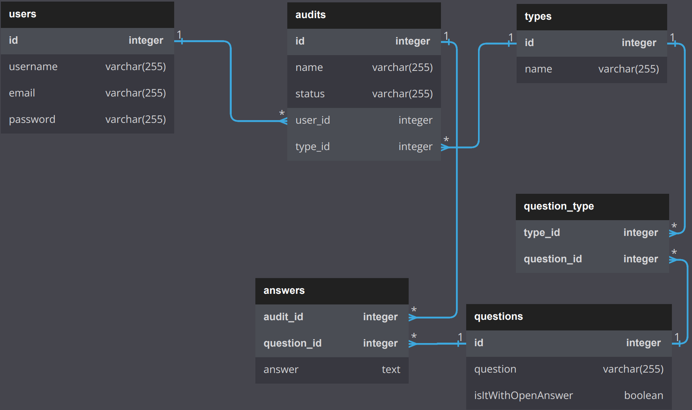
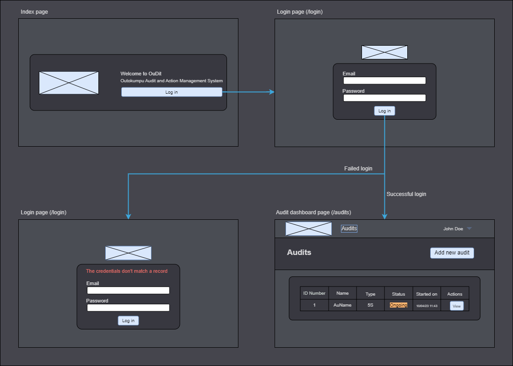
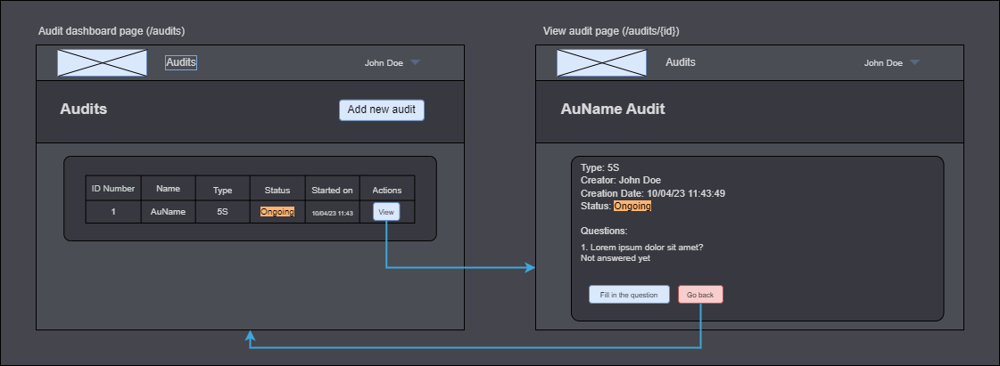
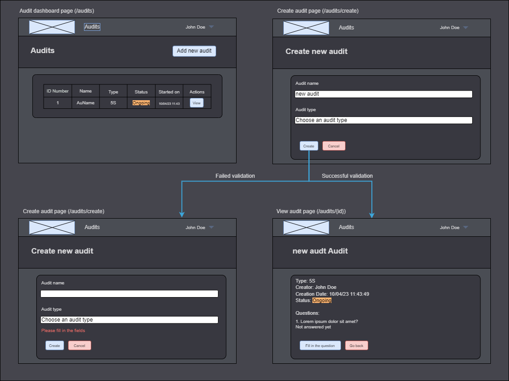
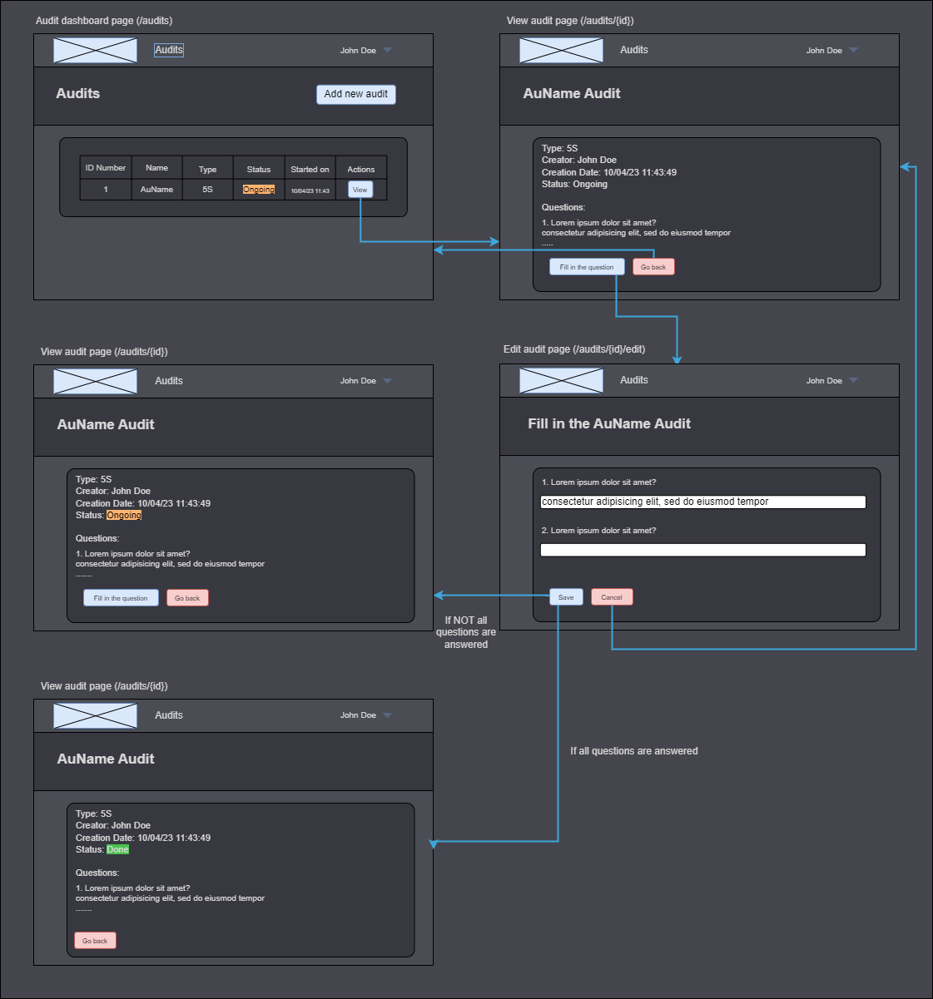

# Framework Project 1
## OuDit - Outokumpu Audit/Action Management System
### Version 1.0 (10.04.23)

## Set-up
1) Clone the repo
2) Run `composer install`
3) Set up the host
4) Copy the `.env.example` in `.env` file
5) Run `php artisan key:generate`
6) Run `php artisan migrate`
7) Run `php arisan db:seed`
8) Run `npm install`
9) Run `npm run build`

## Implementation

### The database

Notes: This is the first version of the db - a lot of places for improvements and changes! (e.g. Status can be an entity...); The timestamps are also left from the diagram

### The seeded data
When `php artisan db:seed` is executed the data that is being filled in the database is the following:
* A user with credentials: `email: john.doe@hz.nl; password: asd123`
* A type of audit - 5S
* All 28 questions relevant to the 5S audit + 'additional comments' question

### User stories
This prototype implements (or implements to a certain degree) the following user stories

| Number | User story                                                                                                                                                                                                              |
|--------|-------------------------------------------------------------------------------------------------------------------------------------------------------------------------------------------------------------------------|
| 1      | As an auditor I want to be able to view all on-going audits relevant to me (corresponding to my level and department) on the audit dashboard page (so that I have up-to-date information about the audits in progress). |
| 2      | As an auditor I want to be able to create a new on-going audit corresponding to my level and department (so that it is displayed in the audit dashboard).                                                               |
| 3      | As an auditor I want to be able to update an on-going audit’s attributes that is within my level and department (so that I can fill the data that has been gathered from the audit).                                    |
| 4      | As an auditor I want to be able to log in the system (so that I access all functionalities that are relevant to me in the app)                                                                                          |

### Wireframes
#### Log in

#### View audit

#### Create new audit

#### Update/Fill audit

### Authentication
The authentication is created with [Laravel Breeze](https://github.com/laravel/breeze)

### Design
The design is created mostly with [Tailwind CSS](https://tailwindcss.com) and [Bulma](https://bulma.io)

---

**Valeria Stamenova** - *Author* - [v-stamenova](https://github.com/v-stamenova)
